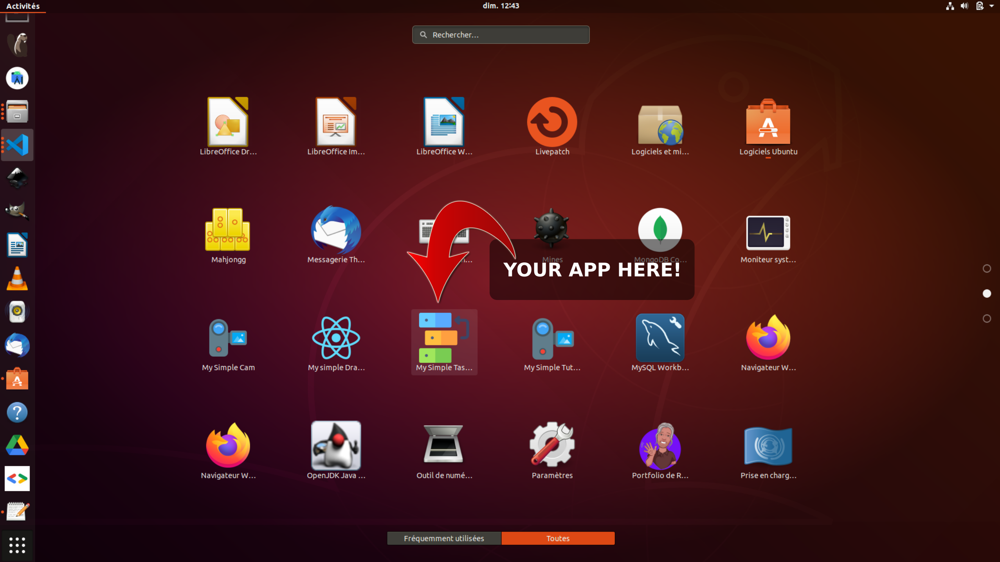

 

[](https://github.com/rodolphe37/my-simple-cam-dektop-app/blob/main/LICENSE)
[](https://github.com/rodolphe37/my-simple-cam-dektop-app/graphs/commit-activity)
[](https://www.javascript.com/)
[](https://github.com/rodolphe37/my-simple-cam-dektop-app/issues)
[](https://open.vscode.dev/rodolphe37/my-simple-cam-dektop-app)
[](https://github.com/Naereen/badges/)


---

## Widget Created with Electron.js & React.js


#  My Simple Tasks Manager

---

## User guide?
>**For the complete user guide follow [this link](https://github.com/rodolphe37/my-simple-tasks-manager-).**
>
>This is My Simple Tasks Manager Desktop version


---

>## **:heavy_exclamation_mark: Your operating system version, Linux, MacOs & Windows.**
>
>>***Linux - Download the .deb file [Here](https://github.com/rodolphe37/my-simple-cam-dektop-app/blob/main/widget-versions/linux/my-simple-cam_0.1.0_amd64.deb?raw=true)***
>>
>>>Double click on the file & click on install button on the window that appear!
>>>
>>>And that's it, it's installed.
>>
>>---
>>
>>***Mac - Download the .dmg file [Here](https://drive.google.com/file/d/1MbXHJgRyfXUr4ICRl4r7UJAi5gNz_SBR/view?usp=sharing)***
>>
>>> Classical installation, like other app for Mac.
>>
>>---
>>
>>***Windows - Download the .exe file [Here](https://drive.google.com/file/d/19-iPbELA5cFTwXGlw0p08b-c6KjPk43M/view?usp=sharing)***
>>
>>>Unzip the file, double click on it!
>>>
>>>And that's it, it's installed.
---

## :heavy_exclamation_mark: Demo on Ubuntu (.deb - all debian versions)

### Installation:


### Start the widget:



### The result:


---

## Mac - Pictures demo

>**installation**


>**Your applications folder**


>**Add to bottom bar**


>**Result**


---

## Windows - Pictures demo

>**Installation...**


>**The result**


---

## Uninstall the Widget

### :heavy_exclamation_mark:  How to uninstall the widget on Ubuntu (Linux)?

> You can uninstall the app with:

```
sudo apt-get remove my-simple-cam
```

### :heavy_exclamation_mark:  How to uninstall the widget on Mac?

> Just delete the app icon on application folder


### :heavy_exclamation_mark:  How to uninstall the widget on Windows?

> The classic way, like all other Windows applications.

---

## You want build/compile your own version

>Fork or clone directly this repository.

### Install the dependencies

```
yarn
```

### Start the App

```
yarn electron:start
```

### Build/compilation

#### For Linux (.deb package)

```
yarn electron:package:linux
```

#### For MacOS compilation (.dmg package)

```
yarn electron:package:mac
```

#### For Windows compilation (.exe package)

```
yarn electron:package:win
```

---


## :bust_in_silhouette: Author

- Thought, designed and developed with :purple_heart: by Rodolphe Augusto

---

## :large_blue_diamond: A few words from the author

Enjoy the World :smirk:

---

## :sparkling_heart: Support the project

I put almost everything open-source I can, and try to accommodate anyone who needs help using these projects. Obviously,
this takes time. You can use this service for free.

However, if you are using this project and are happy with it or just want to encourage me to keep creating: -

- Put a star and share the project :rocket:

Thank you! :heart:

---

## :scroll: License

MIT

---

## My other projects:

>### My Simple Task Manager
>https://github.com/rodolphe37/my-simple-tasks-manager-

>### My Simple Tutorial Creator
>https://github.com/rodolphe37/my-simple-tutorial-creator

>### QRCode Tools
>https://github.com/rodolphe37/qr-code-tools

>### App for decrypt greenPass europe QRcode
>https://github.com/rodolphe37/qrcode-decoder

>### Css animation with Create React App base.
>https://github.com/rodolphe37/halloween2021-bat-tuto-youtube-video

>### My GitHub "open Sources" project
>https://github.com/rodolphe37/pwa-react-project

>### cra-template-github-my-profile
>https://github.com/rodolphe37/cra-template-github-my-profile

>### My Awesome Custom Alert
>https://github.com/rodolphe37/my-awesome-custom-alert

>### Geolocation starter app React-native
>https://github.com/rodolphe37/react-native_geolocation-tracker

>### Classic React Ultimate Messenger version repository (for open sources contributors)
>https://github.com/rodolphe37/rum-open-sources

>### React Ultimate Messenger template for React (create-react-app tools)
>https://github.com/rodolphe37/cra-react-ultimate-messenger

>### PWA React Ultimate Messenger template for React (create-react-app tools)
>https://github.com/rodolphe37/cra-pwa-react-ultimate-messenger

>### installation and initialization shell script for the PWA React Ultimate Messenger template
>https://github.com/rodolphe37/pwa-rum-install-pack

>### Upload-image-profil-component
>https://github.com/rodolphe37/Upload-image-profil-component

>### Jeux libres de droits "open Sources" - Memory Yoga Cards Game - Sort the Waste Game - Match 3 Yoga Game - Tetris Classic Game - Remake Earth Puzzle Game
>https://github.com/rodolphe37/install-games-repository

>### Administration template - React JS & react-admin
>https://github.com/rodolphe37/nfc-updates-front


>### Administration template Backend - Node & Express
>https://github.com/rodolphe37/nfc-updates-back

---
